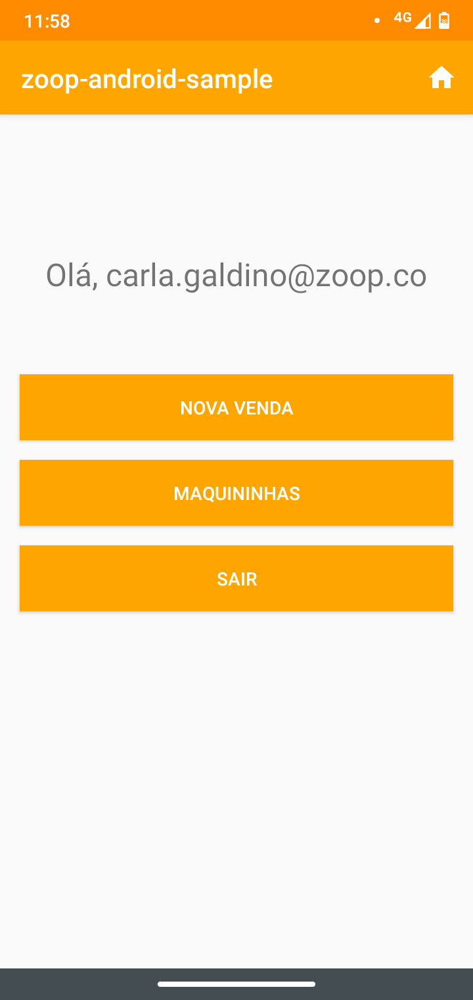
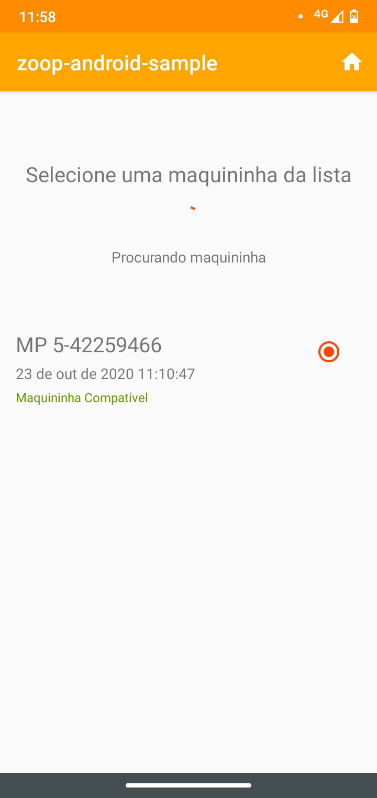
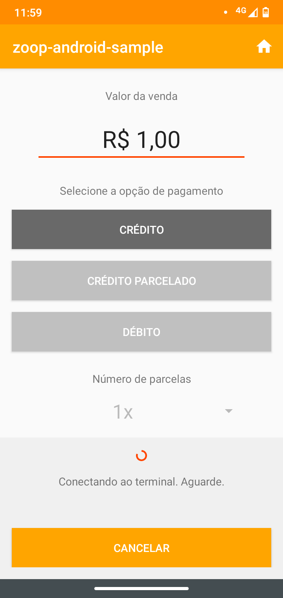
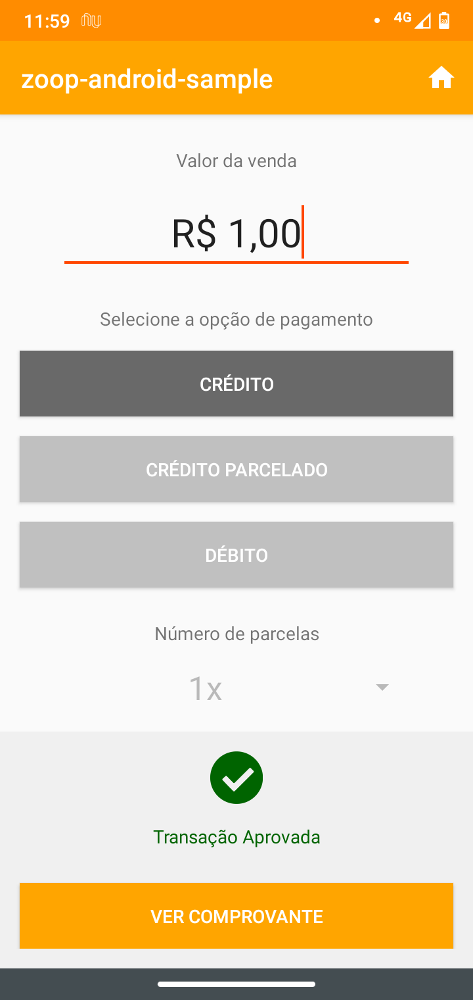
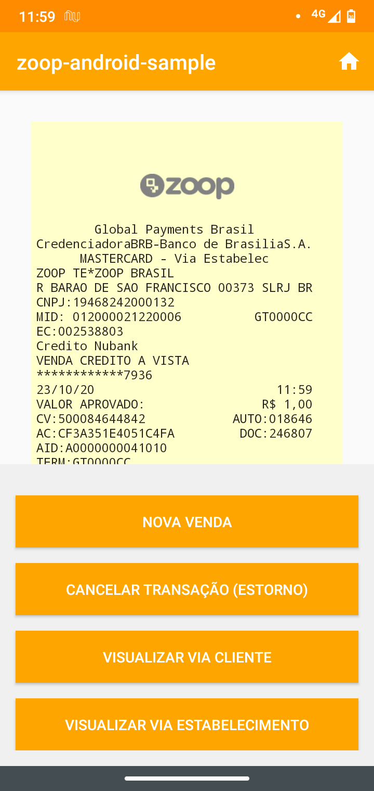
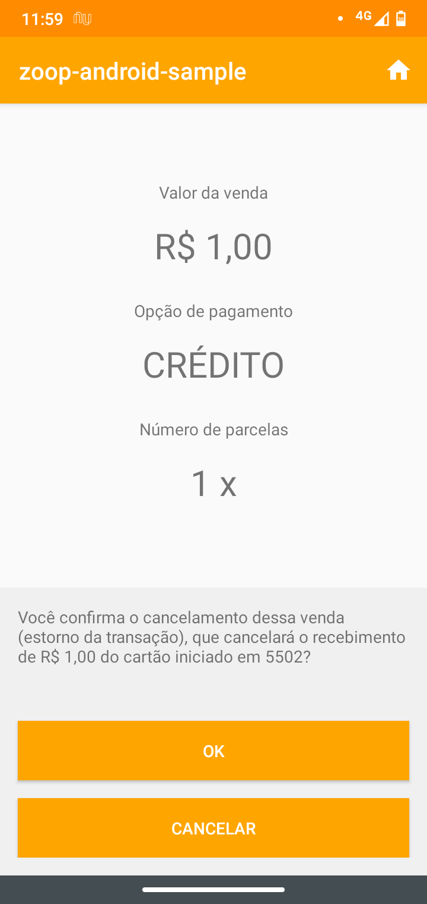
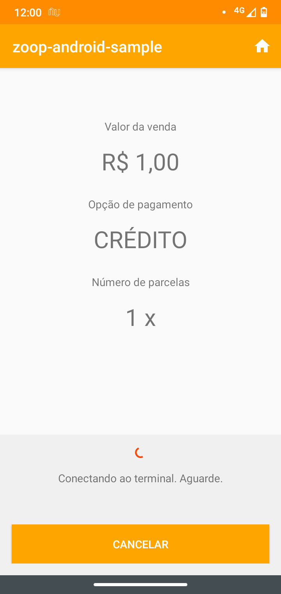
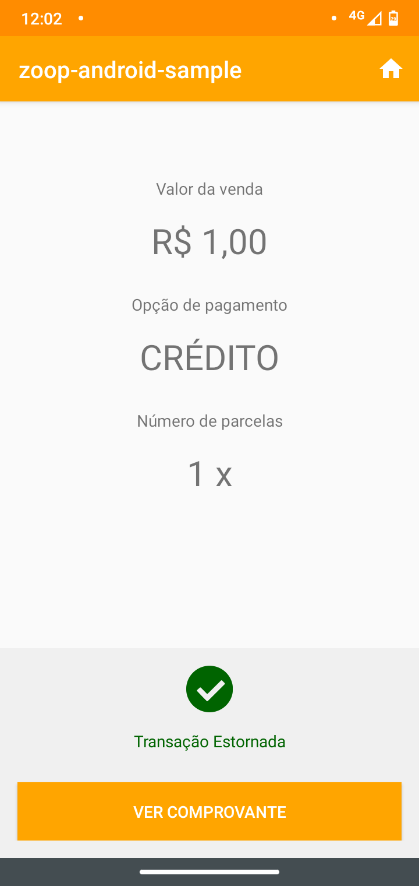
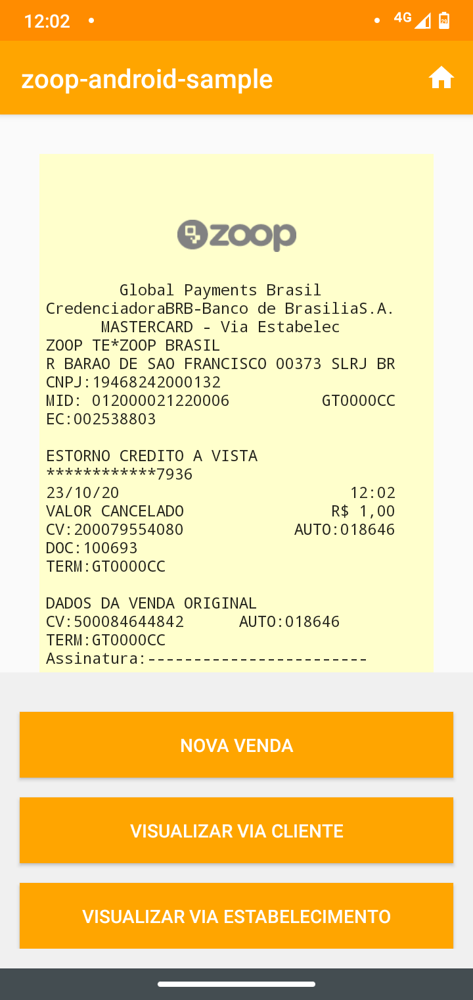

# zoop-android-sample

Se você é desenvolvedor (ou tem acesso à uma equipe de desenvolvimento) e deseja criar seu próprio aplicativo para cobranças com mPOS, você pode utilizar este código como base para sua solução.

Você pode fazer forks do projeto ou simplesmente criar seu próprio repositório com o conteúdo alterado. Como esta é uma solução open-source, queremos o apoio da comunidade. Correções e PRs são super bem vindos.

Por fim, o projeto utiliza nosso SDK de pagamentos Android. Caso note algum problema com seu funcionamento, entre em contato com nosso suporte através do e-mail: suporte@zoop.com.br.


## Configuração

Adicione as variávies `MARKETPLACE_ID` e `PUBLISHABLE_KEY` no `local.properties` do projeto com os devidos valores.

Exemplo com valores fictícios:

```
sdk.dir=/Users/zoop/Library/Android/sdk

MARKETPLACE_ID="0a1b2c3d4e5f6g7h8i9j0k1l2m3n4o5p"
PUBLISHABLE_KEY="                                 "
```

Caso tenha dúvidas em relação a essas credenciais entrar em contato com o suporte. 


## Screenshots

<table>
  <tr>
    <td></td>
    <td></td>
    <td></td>
  </tr>
  <tr>
    <td></td>
    <td></td>
    <td></td>
  </tr>
  <tr>
    <td></td>
    <td></td>
    <td></td>
  </tr>
  <tr>
    <td></td>
  </tr>
 </table>


## Licença

zoop-android-sample está licenciada sob os termos da licença [MIT License](LICENSE) e está disponível gratuitamente.


## Links

* [Docs](https://docs.zoop.co/docs/sdk-android-1)
* [Suporte](suporte@zoop.com.br)
